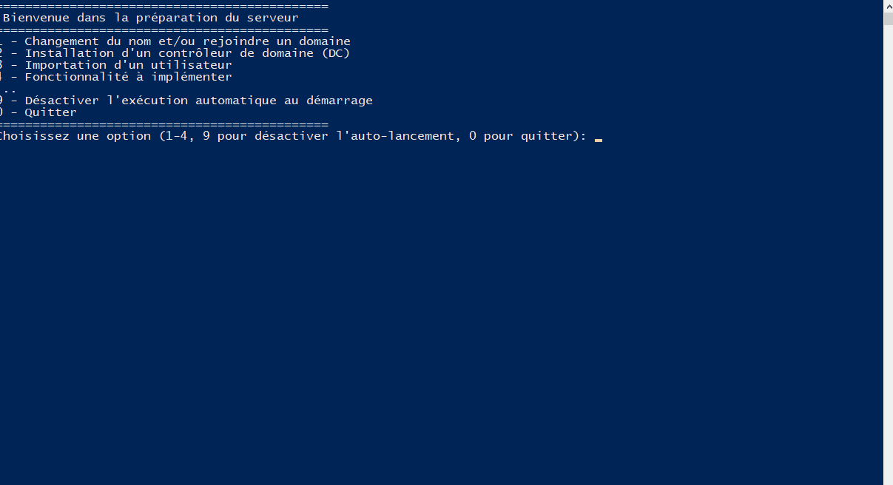
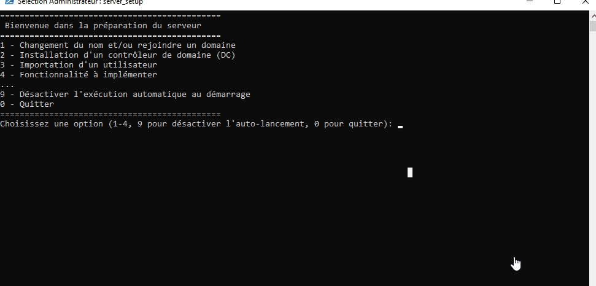
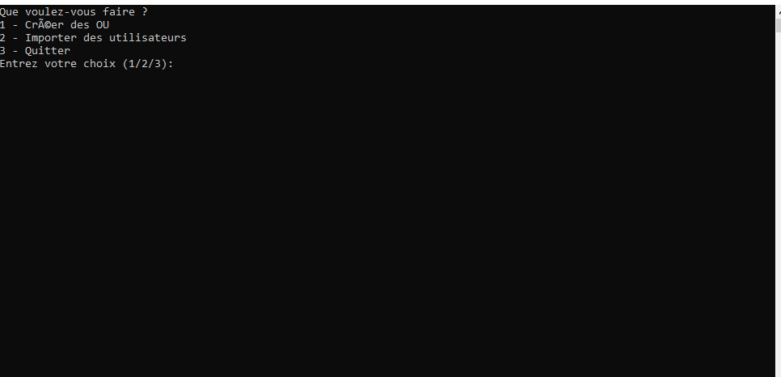

# Projet TSSR 🚀
Script & autre joyeuseté réalisé lors du parcours TSSR au CEFIM.
## Pré-requis
Une installation de Windows Server.
Un accès administrateur sur le serveur.
PowerShell.
Une connexion Internet pour télécharger les scripts
## Importer ce repo 
Créer le dossier "Script" à la racine de C:/ et dans powershell entrer la commande suivante : 
```
$repo = "nodoby-dock/PROJET_TSSR"
>> $zipUrl = "https://github.com/$repo/archive/refs/heads/main.zip"
>> $zipFile = "projet-test.zip"
>> $destinationPath = "C:/Scripts/projet-test"
>>
>> # Supprime le dossier s'il existe
>> Remove-Item -Path $destinationPath -Recurse -Force -ErrorAction SilentlyContinue
>>
>> # Télécharge et extrait l'archive
>> Invoke-WebRequest -Uri $zipUrl -OutFile $zipFile
>> Expand-Archive -Path $zipFile -DestinationPath $destinationPath -Force
>>
>> # Supprime l'archive ZIP
>> Remove-Item -Path $zipFile -Force 
```
# *WinServ-DC* ⚙️
## L'outil parfait pour installer et populate un DC

### Son fonctionnement : 

Le script "_Script_install_total" propose d'executer les scripts ci dessous.

Lors de son lancement manuel il créera un raccourci dans le dossier Startup afin de s'éxécuter apres chaque rédémarrage.
📍 Press "9" pour annuler cet option.


1️⃣ 1-Name&group : Renomme le poste, propose de rejoindre un domaine si nécessaire & vérifie l'adresse IP de la machine.

2️⃣2-DC_creation : Installation d'un DC et promotion en tant que contrôleur. Mais aussi règle de parefeu & RDP.

3️⃣3-import_user : Choix multiple permettant de généré des OUs et/ou de généré des utilisateurs, chacun à l'aide d'un fichier CSV qui doit être présent dans le dossier de lancement du script (ou alors un prompt demandera le chemin du script)

## En détail
### _Script_install_total
Ce script lance un simple menuing qui permet de choisir l'étape de la préparation du service et s'inscrit en démarrage automatique afin de revenir après chaque reboot de la machine lors de l'installation des rôles et services.
L'option (9) permet de désinscrire le démarrage automatique du script au boot de la machine.

###  1-Name&group

L'ensemble des options nécéssaire seront demandé au fur et a mesure avant un rédémarrage obligatoire de la machine.
<p align="center">
  
</p>

### 2-DC_creation

Ce script vient vérifier si la machine appartient déja à un domaine et propose d'en créer un si nécessaire.
Les options tel que le nom de domaine, netbios et le mot de passe de l'AD seront proposé au fil du script.

<p align="center">
  
</p>

### 3-import_user

Ce powershell nécessite deux fichiers CSV distinct. Un pour les OUs et un pour les Users.
Si les CSV sont présent dans le même dossier que le script (comme ceux fournit) l'option de l'utiliser sera proposé. Le cas échant le chemin sera demandé.

<p align="center">
  
</p>

### A Venir

<i>For later use</i>

#
Merci de penser au pôce bleu 👍
✨✨✨


<p align="center">
  
</p>
